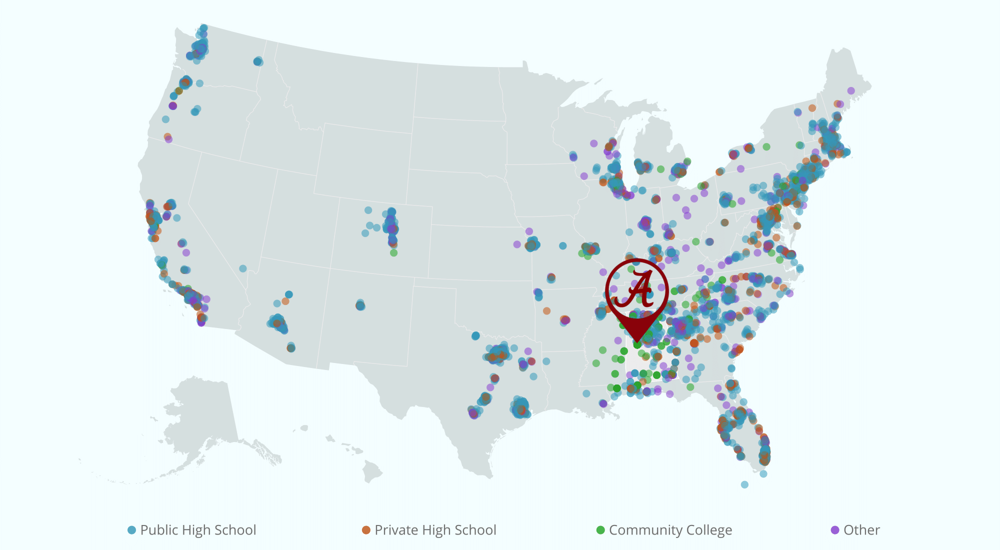

---
title: 'Recruiting the Out-of-State University'
subtitle: 'Off-Campus Recruiting by Public Research Universities'
author: Ozan Jaquette
# lib_cdn: 'https://cdn.rawgit.com/ramnathv/slidifyLibraries/master/inst/libraries'
mode: selfcontained
ext_widgets : {rCharts: [libraries/leaflet]}
framework: revealjs
revealjs:
  theme: custom
  transition: slide
  center: 'false'
bibliography: ./assets/other/spencer-bib.bib
csl: ./assets/other/apa.csl

--- #title

# Recruiting the Out-of-State University
## Off-Campus Recruiting by Public Research Universities

Crystal Han, UCLA

Ozan Jaquette, UCLA

Karina Salazar, University of Arizona

Prepared for:

<a id='link_report' href='https://emraresearch.org/sites/default/files/2019-03/joyce_report.pdf' target='_blank'>Joyce Foundation Report</a>

--- 

# Level 1 Heading
## Level 2 Heading

This is some text. And a citation. The White House (2014)

- This is a list
    - A sublist
        - A sub-sublist

--- #references

# References
## &nbsp;

<a href="#cite-RN4017">[1]</a><cite>
The White House.
<em>Commitments to action on college opportunity</em>.
Tech. rep.
The Executive Office of the President, 2014.</cite>

